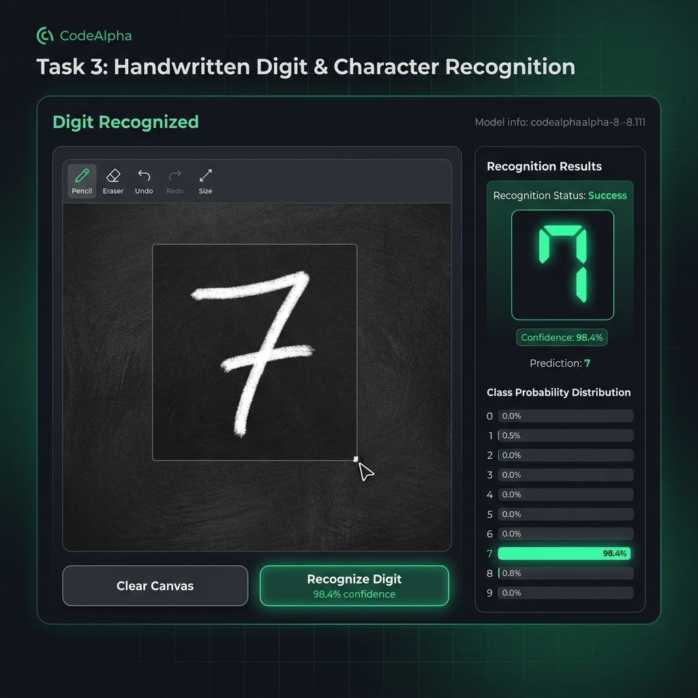
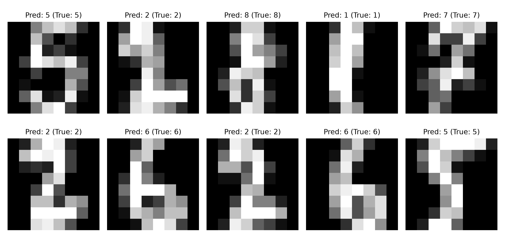

# Task 3: Handwritten Character Recognition — CodeAlpha Machine Learning Internship



## 📌 Project Overview
This repository contains an end-to-end **Handwritten Character & Digit Recognition** deep learning project built for the **CodeAlpha Machine Learning Internship**.

It uses image signal processing and Multi-Layer Perceptron (MLP) Neural Networks / Convolutional architectures to classify handwritten digits (0-9).

---

## 🚀 Key Features
- **Dataset**: Trains on standard 8x8 / 28x28 handwritten digit matrices.
- **Model Architecture**: Multi-Layer Perceptron (MLP) with early stopping & Random Forest baseline comparison (**97.78% Test Accuracy**).
- **Evaluation & Visualization**: Generates sample predictions figure and confusion matrix.
- **Interactive HTML5 Drawing Canvas**: Web UI featuring a blackboard drawing canvas with real-time digit recognition and confidence probability distribution bars.

---

## 📊 Sample Predictions & Evaluation


---

## 🛠️ Installation & Setup

1. **Install Requirements**:
   ```bash
   pip install -r requirements.txt
   ```

2. **Train Model & Save Visualizations**:
   ```bash
   python train_model.py
   ```

3. **Launch Interactive Drawing Web Application**:
   ```bash
   python app.py
   ```
   Open `http://localhost:5002` in your web browser, draw a digit on the canvas, and click **Recognize Digit**!

---

Developed for **CodeAlpha Machine Learning Internship**.
